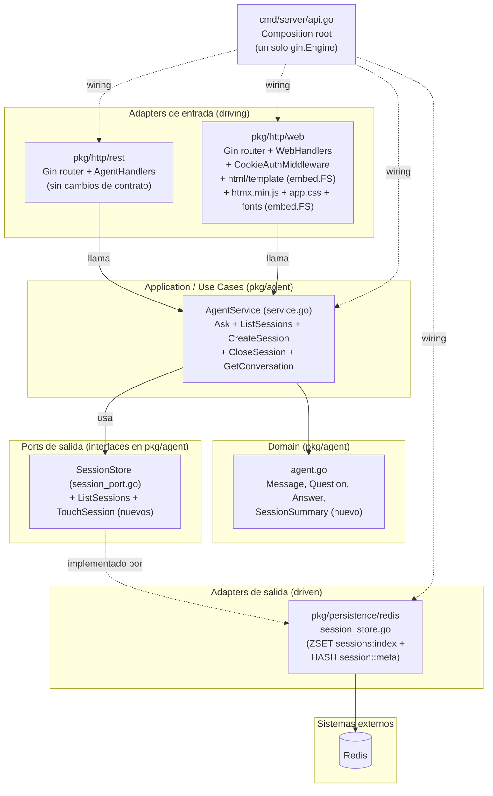

## Context

`mongo-agent` ya expone el caso de uso del agente (`pkg/agent.AgentService.Ask`) únicamente vía `POST /ask` (JSON, ver `openspec/changes/add-nl-mongo-agent/`). Este cambio añade una segunda superficie de entrada, `pkg/http/web`, que sirve HTML renderizado en servidor con [htmx](https://htmx.org) para permitir chatear con el agente desde el navegador, sosteniendo varias conversaciones en paralelo como pestañas (una pestaña = una sesión = un `session_id`), sin frontend build (no Node/npm, no bundler, no SPA framework) y sin duplicar lógica de negocio.

Este documento formaliza las decisiones técnicas necesarias para que `openspec/changes/add-htmx-chat-frontend/tasks.md` pueda ejecutarse de forma mecánica.

## Goals / Non-Goals

**Goals:**
- Servir una página HTML (`GET /web`) con una barra de pestañas (una por sesión) y un panel de chat activo, ambos renderizados server-side con `html/template` de la librería estándar.
- Cada interacción del usuario (cambiar de pestaña, crear pestaña, enviar mensaje, cerrar pestaña) se resuelve con una petición htmx que intercambia solo los fragmentos HTML afectados, sin recarga completa de página.
- Persistir el listado de pestañas (sesiones) en Redis, de forma que sobreviva a recargas del navegador y respete el mismo TTL que el historial de mensajes.
- Proteger `/web` con autenticación por cookie, reutilizando `API_TOKEN`.
- Reutilizar exclusivamente `pkg/agent.AgentService` (ampliado) como único punto de entrada a la lógica de negocio; `pkg/http/web` no importa `pkg/persistence/*` ni `pkg/llm/*`.

**Non-Goals:**
- No hay streaming de tokens (SSE/WebSockets); cada respuesta del agente se renderiza completa, igual que `POST /ask`.
- No hay build step de frontend (sin Node.js/npm, sin bundler, sin framework JS de componentes). Un único archivo `htmx.min.js` vendored y servido por Go.
- No hay autenticación multiusuario; toda pestaña visible es global al Redis del despliegue.
- No hay protección CSRF dedicada más allá de `SameSite=Strict` en la cookie.
- No se reemplaza ni modifica el contrato observable de `POST /ask`.

## Architecture Overview (Hexagonal)

**Regla de dependencia**: `pkg/http/web` importa `pkg/agent` (para invocar `AgentService`) y `pkg/utils` (para el mapeo de errores y validación compartidos), pero nunca `pkg/persistence/*`, `pkg/llm/*`, ni `pkg/http/rest`. `pkg/agent` no importa `pkg/http/web`. Solo `cmd/server/api.go` conoce todos los paquetes concretos.

## Decisions

### D-W1. Un solo `gin.Engine`, dos funciones `RegisterRoutes`
Hoy `pkg/http/rest/router.go` expone `NewHandler(agentHandler, apiToken) *gin.Engine`, que crea su propio `gin.Default()`. Para servir `/ask` y `/web/*` desde el mismo proceso y puerto (`cmd/server/api.go` solo llama `r.Run(":" + port)` una vez), se introduce:
- `func rest.RegisterRoutes(r *gin.Engine, agentHandler AgentHandlers, apiToken string)`: registra `POST /ask` sobre un engine ya existente. `rest.NewHandler` pasa a ser un wrapper delgado que crea `gin.Default()` y llama a `RegisterRoutes` (se preserva para no romper tests existentes que lo usan directamente).
- `func web.RegisterRoutes(r *gin.Engine, handlers WebHandlers, cookieCfg CookieConfig)`: registra todas las rutas `/web/*` sobre el mismo engine.
`cmd/server/api.go` pasa a construir `r := gin.Default()` una sola vez y llamar a ambos `RegisterRoutes`.
- Alternativa considerada: dos servidores HTTP en dos puertos distintos (uno para `/ask`, otro para `/web`). Se descarta por complejidad operativa innecesaria (dos puertos que exponer/documentar) para un proyecto de portafolio de un solo binario.

### D-W2. Autenticación de `/web` por cookie compartiendo `API_TOKEN` (trade-off aceptado explícitamente)
Todas las rutas bajo `/web` excepto `GET /web/login`, `POST /web/login` y `GET /web/static/*` exigen una cookie HttpOnly cuyo valor se compara en tiempo constante (`crypto/subtle.ConstantTimeCompare`) contra `API_TOKEN`. Config vía:
- `WEB_AUTH_COOKIE_NAME` (default `web_auth`)
- `WEB_SESSION_MAX_AGE_SECONDS` (default `604800`, 7 días) — controla el `Max-Age` de la cookie; no hay revocación server-side independiente de este valor.
- `WEB_COOKIE_SECURE` (default `false`; debe fijarse en `true` cuando el despliegue está detrás de TLS/reverse proxy — documentado en README, no forzado por código porque el desarrollo local es HTTP plano).
Cookie: `Path=/web`, `HttpOnly=true`, `SameSite=Strict`, `Secure=<WEB_COOKIE_SECURE>`.
**Trade-off aceptado (idéntico al descrito en `proposal.md`)**: el valor de la cookie es el mismo secreto que el header `Authorization` de `/ask`; no hay expiración server-side independiente del `Max-Age`; no hay protección CSRF dedicada más allá de `SameSite=Strict`; no hay aislamiento por usuario (un solo poseedor de cookie ve todas las sesiones del Redis del despliegue). Aceptable para un proyecto de demo de un solo operador.
Comportamiento de fallo de autenticación (**no ambiguo, obligatorio para `tasks.md`**):
- Si la petición NO es una petición htmx (no trae header `HX-Request: true`): `c.Redirect(http.StatusSeeOther, "/web/login")`.
- Si la petición SÍ es una petición htmx: responder `401` con cuerpo vacío y header `HX-Redirect: /web/login` (htmx intercepta `HX-Redirect` y navega el documento completo a esa URL — es el mecanismo idiomático de htmx para forzar un redirect completo desde una respuesta parcial).

### D-W3. Plantillas HTML embebidas con `html/template` + `embed.FS`
`pkg/http/web/templates/*.html` se compilan al binario con `//go:embed templates/*.html` y se parsean una sola vez en `init()`/constructor con `template.Must(template.ParseFS(...))`. No se usa ningún motor de templates de terceros. Plantillas (nombres exactos de `{{define "..."}}`):
- `layout` (`layout.html`): documento completo (`<html><head>` con `<link rel="stylesheet" href="/web/static/app.css">` + `<script src="/web/static/htmx.min.js">` + `<body>`), incluye `{{template "tab_bar" .Tabs}}` y `{{template "chat_panel" .ActiveTab}}`. Usada solo por `GET /web`. **Actualizado por D-W11**: el `<style>` inline que existía en versiones anteriores de esta plantilla se reemplaza por el `<link>` a la hoja de estilos vendorizada — ver `design-ui.md` §8.
- `login` (`login.html`): formulario `<form method="POST" action="/web/login">` con un campo `token` (`type="password"`) y un mensaje de error opcional. Usada por `GET /web/login` y por `POST /web/login` en caso de token inválido. Mismo `<link rel="stylesheet" href="/web/static/app.css">` que `layout.html` (ver D-W11); ya no lleva `<style>` inline propio.
- `tab_bar` (`tab_bar.html`): fragmento `
...
` — un botón por pestaña (`hx-get="/web/tabs/{{.SessionID}}" hx-target="#chat-panel" hx-swap="innerHTML"`) más un botón "+" (`hx-post="/web/tabs" hx-target="#chat-panel" hx-swap="innerHTML"`) para crear pestaña nueva. El elemento raíz siempre tiene `id="tab-bar"` para permitir swaps fuera de banda (`hx-swap-oob="true"`) desde otros fragmentos.
- `chat_panel` (`chat_panel.html`): fragmento `
...
` con la lista de mensajes (`{{range .Messages}}`) y el formulario de envío (`hx-post="/web/tabs/{{.SessionID}}/messages" hx-target="#chat-panel" hx-swap="innerHTML"`) y un botón de cierre de pestaña (`hx-delete="/web/tabs/{{.SessionID}}" hx-target="#chat-panel" hx-swap="innerHTML"`). El elemento raíz siempre tiene `id="chat-panel"`.
- Alternativa considerada: `text/template`. Se descarta porque `html/template` aplica escape contextual automático de HTML, indispensable porque el contenido de los mensajes (preguntas del usuario, respuestas del LLM) es texto no confiable que se interpola en el DOM.

### D-W4. htmx vendored como archivo estático embebido, sin build step de frontend
Se vendoriza un único archivo `pkg/http/web/static/htmx.min.js` (versión pineada `1.9.12`, licencia BSD-2-Clause), embebido con `//go:embed static/htmx.min.js` y servido por `GET /web/static/htmx.min.js` con `Content-Type: application/javascript; charset=utf-8` y `Cache-Control: public, max-age=86400`. No se introduce Node.js, `npm`, ni ningún paso de compilación de frontend. Esta ruta es pública (sin `CookieAuthMiddleware`) porque `login.html` también necesita cargar el script antes de autenticarse (los botones de la UI, no la carga inicial de datos, dependen de htmx).

### D-W5. Índice de sesiones en Redis: `ZSET` global + `HASH` de metadata por sesión, con limpieza perezosa en lectura
Se añaden dos estructuras nuevas en Redis (además de la lista `session:<id>:messages` ya existente):
- `sessions:index` — un único `ZSET` global. Miembro = `session_id`. Score = timestamp Unix (segundos) de la última actividad. Sin TTL propio (una entrada solo se elimina explícitamente, nunca expira automáticamente por sí sola — la expiración real ocurre en la metadata, ver limpieza perezosa abajo).
- `session:<id>:meta` — un `HASH` por sesión con los campos `title` (string) y `last_activity` (timestamp Unix en string). TTL igual a `SESSION_TTL_SECONDS`, reestablecido en cada `TouchSession`, igual que la lista de mensajes.

**`TouchSession(ctx, sessionID, title, at)`** (nuevo método de `SessionStore`) ejecuta, en una sola llamada `Pipelined`:
1. `HSETNX session:<id>:meta title <title>` — el título solo se fija la primera vez que se llama `TouchSession` para esa sesión; llamadas posteriores NO sobrescriben el título ya fijado (así el título queda derivado de la primera pregunta, como exige `proposal.md`).
2. `HSET session:<id>:meta last_activity <at.Unix()>`
3. `EXPIRE session:<id>:meta <ttl>`
4. `ZADD sessions:index <at.Unix()> <sessionID>`

**`ListSessions(ctx)`** (nuevo método de `SessionStore`):
1. `ZREVRANGE sessions:index 0 -1` para obtener los IDs ordenados por actividad más reciente primero.
2. Para todos los IDs obtenidos, ejecutar `HGETALL session:<id>:meta` para cada uno **dentro de una única llamada `Pipelined`** (no una ida y vuelta a Redis por sesión).
3. Para cada resultado: si el `HGETALL` devuelve un mapa vacío (la clave expiró — limpieza perezosa), encolar un `ZREM sessions:index <id>` (ejecutado también en una sola `Pipelined` al final del método) y omitir esa sesión del resultado devuelto. Si el mapa no está vacío, construir `SessionSummary{SessionID: id, Title: meta["title"], LastActivity: time.Unix(parse(meta["last_activity"]), 0)}`.
4. Devolver el slice resultante en el mismo orden ya obtenido de `ZREVRANGE` (más reciente primero).
Esto implementa la "limpieza perezosa en lectura" descrita en `proposal.md`: no existe ningún proceso en segundo plano ni cron; una sesión deja de listarse en la primera llamada a `ListSessions` posterior a la expiración de su TTL.

**`ClearSession(ctx, sessionID)`** (modificado) ejecuta, en una sola `Pipelined`: `DEL session:<id>:messages`, `DEL session:<id>:meta`, `ZREM sessions:index <id>`.

- Alternativa considerada: guardar la lista de sesiones como un `SET` simple sin score. Se descarta porque el requisito pide orden por actividad más reciente, que un `SET` no preserva; un `ZSET` con score = timestamp lo da gratis vía `ZREVRANGE`.
- Alternativa considerada: usar `HEXPIRE` (expiración por campo de hash, Redis >= 7.4) para evitar la limpieza perezosa. Se descarta por sobre-ingeniería y por no asumir una versión mínima de Redis más allá de la ya usada por el proyecto (Redis 7 genérico, ver `docker-compose.yml`); la limpieza perezosa en lectura es suficientemente simple y correcta para el volumen de un portafolio.

### D-W6. Sesiones "efímeras" hasta el primer mensaje
`AgentService.CreateSession(ctx)` genera un nuevo `session_id` (`uuid.NewString()`) y devuelve `SessionSummary{SessionID: id, Title: "Nueva conversación", LastActivity: time.Now()}` **sin** llamar a `SessionStore.TouchSession` ni a ningún método que escriba en Redis. La pestaña nueva es puramente visual (server-rendered, no persistida) hasta que el usuario envía su primer mensaje; en ese momento `Ask` llama internamente a `TouchSession`, momento en el que la sesión pasa a aparecer en `ListSessions`. Esto es consistente con la regla de negocio ya fijada en `proposal.md`: "toda sesión que recibe al menos una pregunta ... queda indexada". Consecuencia directa: si el usuario crea una pestaña nueva y nunca escribe nada, esa pestaña desaparece al recargar la página (comportamiento esperado, no es un bug).

### D-W7. Re-render completo del panel de chat en cada interacción (sin streaming ni parches incrementales)
Cada handler que modifica el estado de una sesión (`SendMessage`, `SwitchTab`, `NewTab`, `CloseTab`) responde con el fragmento `chat_panel` **completo** (recalculado desde `AgentService.GetConversation`), reemplazando `#chat-panel` entero vía `hx-swap="innerHTML"` sobre el elemento contenedor externo (nunca sobre `#chat-panel` mismo, para evitar duplicar el `id`). No se implementa append incremental de un solo mensaje ni streaming de tokens (coherente con el non-goal ya fijado en `proposal.md` y en `add-nl-mongo-agent`). Esto simplifica los handlers: no hay estado de "mensaje en progreso" que rastrear.

### D-W8. `GetConversation` filtra mensajes de rol `tool` y `system` para presentación
`AgentService.GetConversation(ctx, sessionID)` llama a `SessionStore.GetHistory` y devuelve únicamente los mensajes con `Role == RoleUser` o `Role == RoleAssistant`, en el mismo orden cronológico, **omitiendo** los mensajes `RoleTool` (resultados crudos de MongoDB) y `RoleSystem` (que de todas formas nunca se persisten, ver `service.go`). Razón: los resultados de tool-calling son detalle de implementación del agente, no contenido apto para mostrar directamente a un usuario de la UI web; el historial completo (incluyendo `tool`) se sigue usando intacto para el contexto enviado al LLM en `Ask`, que no cambia.

### D-W9. Mapeo de errores compartido entre `pkg/http/rest` y `pkg/http/web`
Se extrae a `pkg/utils/errors.go` la función `func HTTPStatusForError(err error) (status int, message string)` que centraliza el mapeo ya existente en `pkg/http/rest/agent.go` (`respondError`): `utils.ErrToolLoopExceeded` → `502`; `utils.ErrRequestTimeout` → `504`; `utils.IsLLMProviderUnavailable(err)` → `502`; `utils.IsSessionStoreUnavailable(err)` → `503`; cualquier otro error → `503` con mensaje genérico `"service temporarily unavailable"`. `pkg/http/rest/agent.go` se refactoriza para que `respondError` delegue en `utils.HTTPStatusForError` (sin cambiar el comportamiento observable de `POST /ask`, ver tests de regresión en `tasks.md`). `pkg/http/web` usa la misma función para decidir si renderiza el `chat_panel` con un mensaje de error inline (ver D-W7: sigue respondiendo `200` con el fragmento HTML conteniendo el mensaje de error, **no** un código de estado 5xx, porque htmx no reemplaza el contenido del target en respuestas de error a menos que se configure `hx-swap` con `error`; se documenta esto como comportamiento explícito, no ambiguo, en la sección de handlers de `tasks.md`).

### D-W10. Validación de `session_id` compartida entre adapters
Se extrae a `pkg/utils/validation.go` la función `func IsValidSessionID(id string) bool` que reutiliza exactamente el mismo patrón ya usado en `pkg/http/rest/agent.go` (`^[a-zA-Z0-9_-]+$`, no vacío). `pkg/http/rest/agent.go` se refactoriza para usarla (elimina el `sessionIDRegex` local duplicado); `pkg/http/web` la usa para validar el parámetro de ruta `:sessionId` en `SwitchTab`, `SendMessage` y `CloseTab` antes de invocar `AgentService`.

### D-W11. Hoja de estilos y tipografía vendorizadas como assets estáticos embebidos (mismo patrón que D-W4)
Siguiendo las decisiones visuales formalizadas en `design-ui.md` (ver sección `## UI/UX` de este documento), se extrae el CSS a un archivo único `pkg/http/web/static/app.css` en vez de mantener el `<style>` inline duplicado que hoy existe por separado en `layout.html` y `login.html`. Se aplica exactamente el mismo mecanismo ya usado para `htmx.min.js` (D-W4):
- `pkg/http/web/static/app.css`: contiene las variables CSS (`:root { --color-...; --font-...; --space-...; }`), las reglas de componente (`#tab-bar`, `.msg`, `.msg-user`, `.msg-assistant`, botones primario/secundario, `.error`, `:focus-visible`, `.htmx-swapping`) y las declaraciones `@font-face` descritas en `design-ui.md` §3–§7. Embebido con `//go:embed static/app.css`, servido por `GET /web/static/app.css` con `Content-Type: text/css; charset=utf-8` y `Cache-Control: public, max-age=31536000, immutable` (a diferencia de `htmx.min.js`, que usa `max-age=86400`, porque `app.css` no tiene versión pineada en el nombre de archivo — se documenta explícitamente que un cambio futuro de estilos requiere que los operadores fuercen la recarga de caché del navegador, aceptable para un proyecto de portafolio de un solo operador).
- `pkg/http/web/static/fonts/jetbrains-mono-400.woff2` y `pkg/http/web/static/fonts/jetbrains-mono-600.woff2` (subset `latin`, pesos `400`/`600` únicamente, ver `design-ui.md` §3.3): embebidos con `//go:embed static/fonts/*.woff2`, servidos por `GET /web/static/fonts/:filename` con `Content-Type: font/woff2` y el mismo `Cache-Control: public, max-age=31536000, immutable`.
- Ambas rutas son públicas (sin `CookieAuthMiddleware`), igual que `/web/static/htmx.min.js` en D-W4, porque `login.html` (accesible sin autenticar) también carga `app.css` y las fuentes.
- `layout.html` y `login.html` reemplazan su bloque `<style>` inline por `<link rel="stylesheet" href="/web/static/app.css">` (ver D-W3, actualizado). El `<script src="/web/static/htmx.min.js">` no cambia de posición ni de mecanismo.
- Alternativa considerada: mantener el CSS inline duplicado en ambas plantillas. Se descarta porque ya está duplicado byte a byte hoy (confirmado en `design-ui.md` §8) y cualquier cambio de paleta/tipografía futuro obligaría a editar y sincronizar dos archivos a mano — un único `app.css` es la fuente de verdad, cacheable entre `login.html` y `layout.html` igual que ya ocurre con `htmx.min.js`.

### D-W12. Formato de resultado `csv` opcional en `query_find` y `query_aggregate`
Los tools `query_find`/`query_aggregate` aceptan un nuevo parámetro opcional `format` (`"json"` por defecto, `"csv"` como alternativa). Con `format="csv"`, `DispatchToolCall` convierte el array JSON devuelto por el repositorio a CSV con la función privada `jsonArrayToCSV` (`pkg/agent/csv_format.go`, basada en `encoding/csv` de la librería estándar): columnas = unión estable de claves de primer nivel (ordenadas alfabéticamente dentro de cada documento antes de la unión), valores primitivos tal cual, `null` como celda vacía, objetos/arrays anidados como JSON compacto dentro de la celda. Razón: (a) el CSV es ~40–60% más compacto en tokens que el JSON equivalente para resultados tabulares, lo que reduce el riesgo de agotar `AGENT_MAX_TOOL_ITERATIONS` en consultas grandes (problema observado en uso real); (b) el CSV es directamente copiable/exportable por el usuario cuando el agente lo cita en su respuesta. El comportamiento por defecto (`json`) no cambia — los consumidores y tests existentes no se ven afectados. La conversión ocurre en la capa de aplicación (`pkg/agent`), nunca en el adapter web: el resultado del tool viaja como string igual que antes.

### D-W13. Tablas Markdown del asistente renderizadas como `<table>` HTML segura, sin `template.HTML`
El system prompt instruye al agente a presentar datos tabulares como tabla Markdown con pipes (GFM: cabecera, línea separadora `|---|`, filas) y a no usar adornos `**` (la interfaz no renderiza markdown general). Para presentarlas, `pkg/http/web` segmenta el contenido de cada mensaje con `parseMessageContent` (`pkg/http/web/markdown_table.go`) en `messageSegment{Kind: "text"|"table", Text, Header, Rows}`; `messageViewModel` pasa de `Content string` a `Segments []messageSegment`, y `chat_panel.html` itera los segmentos interpolando texto y celdas siempre con `{{.}}` — el auto-escape contextual de `html/template` se aplica igual que antes, sin introducir `template.HTML` ni renderers de markdown de terceros (coherente con D-W3). Regla de detección: una tabla requiere línea con pipes seguida de línea separadora compuesta únicamente por `|`, `-`, `:` y espacios con al menos un guion; pipes sueltos en texto normal no disparan el parser (cubierto por tests). Los estilos visuales de `.md-table` se definen en `app.css` (ver `design-ui.md` §11).

## UI/UX

Las decisiones visuales completas (paleta de color con ratios de contraste WCAG verificados, tipografía monoespaciada autoalojada, escala de espaciado, estados de mensaje usuario/asistente, estado de pestaña activa/inactiva, foco de teclado y una micro-animación opcional de swap de htmx) están documentadas en `design-ui.md` (mismo directorio de este change). Este documento (`design.md`) solo referencia esas decisiones a nivel de arquitectura/wiring (ver D-W3 y D-W11); no se duplica aquí ningún valor de color, tamaño ni regla CSS — `design-ui.md` es la única fuente de verdad para el sistema visual.

## Port Contracts (resumen, solo lo nuevo/modificado)

| Puerto/Tipo | Dirección | Definido en | Cambio |
|---|---|---|---|
| `SessionStore.ListSessions(ctx) ([]SessionSummary, error)` | Salida (driven) | `pkg/agent/session_port.go` | Nuevo método |
| `SessionStore.TouchSession(ctx, sessionID, title string, at time.Time) error` | Salida (driven) | `pkg/agent/session_port.go` | Nuevo método |
| `SessionStore.ClearSession(ctx, sessionID) error` | Salida (driven) | `pkg/agent/session_port.go` | Comportamiento modificado (ahora también limpia el índice) |
| `SessionSummary` | Domain (tipo de valor) | `pkg/agent/session_port.go` | Nuevo tipo |
| `AgentService.ListSessions(ctx) ([]SessionSummary, error)` | Entrada (driving) | `pkg/agent/service.go` | Nuevo método |
| `AgentService.CreateSession(ctx) (SessionSummary, error)` | Entrada (driving) | `pkg/agent/service.go` | Nuevo método |
| `AgentService.CloseSession(ctx, sessionID) error` | Entrada (driving) | `pkg/agent/service.go` | Nuevo método |
| `AgentService.GetConversation(ctx, sessionID) ([]Message, error)` | Entrada (driving) | `pkg/agent/service.go` | Nuevo método |
| `WebHandlers` | Entrada (driving, HTTP) | `pkg/http/web/handlers.go` | Nueva interfaz |
| `utils.HTTPStatusForError(err) (int, string)` | Utilidad compartida | `pkg/utils/errors.go` | Nueva función |
| `utils.IsValidSessionID(id string) bool` | Utilidad compartida | `pkg/utils/validation.go` | Nueva función |

## Testing Strategy por capa

- **Dominio** (`SessionSummary`, `deriveTitle`): tests unitarios sin mocks — construcción del tipo y casos de truncado de título (texto corto sin cambios, texto largo truncado a `sessionTitleMaxLength` con sufijo `…`, texto con espacios al inicio/fin recortado).
- **Application** (`service.go` ampliado): tests unitarios reutilizando los mismos fakes manuales ya existentes en `test/agent_service_test.go` (`fakeSessionStore` ampliado con `ListSessions`/`TouchSession` en memoria) — se cubre: `Ask` llama a `TouchSession` con el título derivado solo si es la primera vez; `ListSessions` delega tal cual en `SessionStore.ListSessions`; `CreateSession` nunca invoca ningún método de `SessionStore` (verificado con un contador de llamadas en el fake); `CloseSession` delega en `SessionStore.ClearSession`; `GetConversation` filtra mensajes `tool`/`system` preservando orden.
- **Adapter Redis** (`pkg/persistence/redis/session_store.go`): tests de integración reales en `test/integration/redis_session_test.go` (mismo build tag `integration`, mismo patrón `t.Skip` sin `REDIS_ADDR`) — cubren `TouchSession` + `ListSessions` orden por actividad, preservación de título en llamadas repetidas, limpieza perezosa de una entrada expirada (test que fija un TTL corto, espera a que expire, y verifica que `ListSessions` ya no la devuelve), y `ClearSession` removiendo también del índice.
- **Adapter Web** (`pkg/http/web`): tests con `httptest` de Go y un `fakeAgentService` (implementa el `AgentService` ampliado), en `test/http_web_test.go`, verificando: redirect a `/web/login` sin cookie (petición normal) vs. header `HX-Redirect` (petición con `HX-Request: true`); `POST /web/login` fija la cookie con token válido y la rechaza con token inválido; `GET /web` renderiza una pestaña efímera cuando no hay sesiones persistidas; `POST /web/tabs` no llama a ningún método de escritura del `AgentService` distinto de `CreateSession`; `POST /web/tabs/:id/messages` invoca `Ask` y el fragmento devuelto contiene el nuevo mensaje; `DELETE /web/tabs/:id` invoca `CloseSession`; `GET /web/static/htmx.min.js` responde `200` con `Content-Type: application/javascript...`; `GET /web/static/app.css` responde `200` con `Content-Type: text/css...` (ver D-W11); `GET /web/static/fonts/jetbrains-mono-400.woff2` responde `200` con `Content-Type: font/woff2` (ver D-W11).
- **Adapter REST (regresión)**: los tests existentes en `test/http_rest_test.go` deben seguir pasando sin modificación de expectativas tras el refactor de D-W1/D-W9/D-W10 (criterio de no-regresión explícito en `tasks.md`).

## Risks / Trade-offs

- [Riesgo] Confundir "cambiar de pestaña" con "actividad de sesión" inflaría el orden del listado sin que el usuario haya escrito nada. → Mitigación: D-W5/D-W6 — solo `Ask` (una pregunta real) llama a `TouchSession`; `SwitchTab` es de solo lectura sobre el índice.
- [Riesgo] `ListSessions` con muchas sesiones activas simultáneas podría generar N llamadas a Redis. → Mitigación: D-W5 obliga a usar una única `Pipelined` para todos los `HGETALL`.
- [Trade-off] La cookie de `/web` comparte secreto con `API_TOKEN` (ver D-W2, aceptado explícitamente igual que en `proposal.md`).
- [Trade-off] Sin streaming, el usuario espera la respuesta completa del agente (igual límite de `AGENT_REQUEST_TIMEOUT_SECONDS` que ya existe para `/ask`); una pregunta lenta se percibe como una UI "congelada" hasta que htmx recibe la respuesta. Aceptado por ser un non-goal ya fijado.
- [Trade-off] `html/template` sin ningún framework de componentes implica que los fragmentos htmx se recalculan completos en cada interacción (D-W7); para el volumen de mensajes esperado en un portafolio esto es intrascendente en rendimiento.

## Migration Plan

No aplica: extensión de un proyecto sin usuarios reales. Orden de despliegue: (1) añadir las variables nuevas a `.env` a partir de `.env.example` actualizado, (2) `docker-compose up -d` (Redis, sin cambios), (3) `make run`, (4) validar manualmente entrando a `http://localhost:8080/web/login` con el mismo valor de `API_TOKEN`.

## Open Questions

Ninguna pendiente: el alcance de "pestañas = sesiones", la ausencia de streaming, y el mecanismo de autenticación por cookie ya fueron fijados explícitamente en `proposal.md` antes de este documento.
