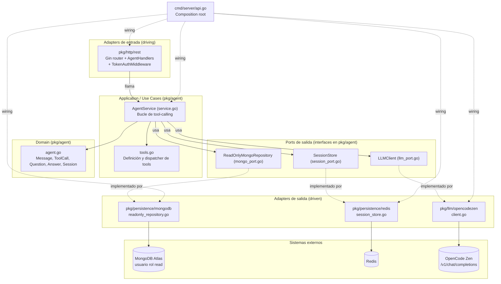

## Context

`mongo-agent` es un proyecto **nuevo** de portafolio público (GitHub, cuenta `HongXiangZuniga`). Recibe preguntas en lenguaje natural vía HTTP, las traduce a consultas MongoDB mediante un LLM con tool-calling, mantiene memoria de conversación en Redis, y devuelve una respuesta en texto. La base de datos es un clúster de MongoDB Atlas ya existente (dirección real fuera del repo, ver `.env.example`) con un usuario dedicado de rol `read`.

**Nota de alcance / legal**: existe un proyecto interno propietario del empleador del usuario (`sabe-team/agent-data`, repo privado) que resuelve un problema conceptualmente similar (preguntas en lenguaje natural → Mongo vía tool-calling). Ese repositorio se usó **únicamente como referencia de lectura** para entender patrones generales de arquitectura agéntica (bucle de tool-calling, separación en capas). **Ningún código, nombre de función/tipo, prompt, ni estructura textual de ese repositorio se copia o parafrasea aquí.** Todo el código de `mongo-agent` es diseñado y escrito de forma independiente y original. La única referencia de código que se replica deliberadamente (y que es pública) es `github.com/HongXiangZuniga/CrudGoExample`, usada como plantilla de convenciones de carpetas y estilo hexagonal en Go.

## Goals / Non-Goals

**Goals:**
- Endpoint HTTP `POST /ask` que traduce preguntas en lenguaje natural a consultas MongoDB de solo lectura y devuelve una respuesta en texto.
- Garantía de solo-lectura verificable en múltiples capas (rol de Mongo + puerto sin métodos de escritura + validación de pipelines + chequeo activo de arranque).
- Memoria de conversación por sesión, persistida en Redis con TTL, para permitir preguntas de seguimiento.
- Descubrimiento dinámico del esquema de Mongo (sin hardcodear colecciones/campos de negocio).
- Puerto de LLM desacoplado de cualquier SDK propietario, con un adapter concreto para OpenCode Zen.
- Arquitectura hexagonal estricta, replicando las convenciones de carpetas de `CrudGoExample`.

**Non-Goals:**
- No hay UI web (solo API HTTP).
- No hay autenticación multiusuario ni roles (solo un token estático de servicio).
- No hay escritura, actualización ni borrado de datos en ninguna circunstancia.
- No hay soporte multi-tenant ni multi-base de datos; un solo `MONGODB_URI`/`MONGODB_DB_NAME` por despliegue.
- No se implementa streaming de respuesta (SSE/websockets); la respuesta HTTP es síncrona.
- No se persiste el historial de conversación de forma permanente (Redis con TTL, no es un data warehouse de conversaciones).

## Architecture Overview (Hexagonal)



**Regla de dependencia**: `pkg/agent` (domain + ports + application) no importa `gin`, `mongo-driver`, `redis` ni ningún cliente HTTP concreto. Los paquetes `pkg/persistence/*` y `pkg/llm/*` importan `pkg/agent` para implementar sus interfaces, nunca al revés. `pkg/http/rest` importa `pkg/agent` (para invocar `AgentService`) pero `pkg/agent` no conoce a `pkg/http/rest`. `cmd/server/api.go` es el único lugar que conoce todos los paquetes concretos y los conecta (constructor injection explícito, sin frameworks de DI).

## Decisions

### D1. Estructura de carpetas: replicar `CrudGoExample`, no el layout genérico `internal/`
Se decide usar `pkg/<dominio>/{domain, ports, service}` (archivos separados dentro del mismo paquete Go, igual que `pkg/Users/{users.go, repository.go, service.go}` en `CrudGoExample`) en lugar del layout genérico `/internal/<dominio>/{domain,application,ports,adapters}`. Esto es una decisión explícita del usuario para mantener consistencia de portafolio entre ambos repos públicos.
- Ports (interfaces) se definen en el paquete `pkg/agent`, que es el paquete "consumidor" de esas interfaces (idiomático en Go: "accept interfaces, return structs").
- Alternativa considerada: `internal/` para impedir imports externos del código. Se descarta porque el proyecto de referencia usa `pkg/` y es un proyecto de portafolio pequeño donde no hay necesidad real de ocultar paquetes.

### D2. Un solo paquete `pkg/agent` para domain + ports + application
Se agrupan entidades (`agent.go`), los tres ports de salida (`llm_port.go`, `mongo_port.go`, `session_port.go`) y el caso de uso (`service.go`, `tools.go`) en el mismo paquete `pkg/agent`, igual que `CrudGoExample` agrupa `users.go` + `repository.go` + `service.go` en `pkg/Users`. No se crean sub-paquetes `domain/`, `ports/`, `application/` separados porque el dominio es pequeño (una sola capability) y separarlos en sub-paquetes adicionales sería sobre-ingeniería para este alcance.
- Alternativa considerada: separar en `pkg/agent/domain`, `pkg/agent/ports`, `pkg/agent/application`. Se descarta por tamaño del proyecto (YAGNI) y para mantener la paridad estructural con `CrudGoExample`.

### D3. Puerto `LLMClient` y adapter OpenCode Zen
```go
type ToolDefinition struct {
    Name        string
    Description string
    Parameters  map[string]any // JSON Schema del parámetro (tipo objeto)
}

type LLMRequest struct {
    Messages []Message
    Tools    []ToolDefinition
}

type LLMResponse struct {
    Message      Message // puede incluir ToolCalls
    FinishReason string
}

type LLMClient interface {
    CompleteChat(ctx context.Context, req LLMRequest) (LLMResponse, error)
}
```
El adapter concreto (`pkg/llm/opencodezen/client.go`) implementa `LLMClient` con `net/http` estándar (sin SDK propietario), apuntando a `OPENCODE_BASE_URL` (default `https://opencode.ai/zen/v1`) + `/chat/completions`, con header `Authorization: Bearer $OPENCODE_API_KEY` y el modelo definido en `OPENCODE_MODEL` (formato `opencode/<model-id>`). El payload/response siguen el formato OpenAI `chat.completions` (roles `system/user/assistant/tool`, `tool_calls`, `tool_call_id`). Cambiar de proveedor de LLM en el futuro implica solo escribir un nuevo adapter que implemente `LLMClient`; `pkg/agent` no cambia.
- Alternativa considerada: usar una librería cliente de OpenAI de terceros. Se descarta para mantener cero dependencias pesadas y control total del payload (tools, streaming desactivado, timeouts).

### D4. Puerto `ReadOnlyMongoRepository` — la garantía de solo lectura
```go
type CollectionInfo struct {
    Name string
}

type FieldSample struct {
    Field        string
    Types        []string
    ExampleValue string
}

type ReadOnlyMongoRepository interface {
    ListCollections(ctx context.Context) ([]CollectionInfo, error)
    DescribeCollection(ctx context.Context, collection string, sampleSize int) ([]FieldSample, error)
    Find(ctx context.Context, collection string, filterJSON string, projectionJSON string, limit int) (string, error)
    Aggregate(ctx context.Context, collection string, pipelineJSON string, limit int) (string, error)
}
```
La garantía de solo lectura se aplica en **cuatro capas independientes**, de forma que ninguna capa por sí sola es el único punto de falla:
1. **Infraestructura**: el usuario configurado en `MONGODB_URI` tiene rol `read` en el clúster de Atlas (gestionado fuera del repo, documentado en README/`.env.example`).
2. **Contrato del puerto**: `ReadOnlyMongoRepository` **no declara ningún método de escritura** (`InsertOne`, `UpdateOne`, `DeleteOne`, `Drop`, etc. no existen en la interfaz). El compilador de Go impide que `pkg/agent` invoque una operación de escritura porque el tipo no la expone.
3. **Validación del adapter**: `Aggregate` rechaza explícitamente (antes de llamar al driver) cualquier pipeline que contenga stages de escritura conocidos (`$out`, `$merge`) o de administración (`$currentOp`, `$listSessions` con privilegios). `Find`/`Aggregate` siempre se ejecutan con `readpref.Primary()`/`SecondaryPreferred` (nunca `write concern` alto) y limitan `limit` a un máximo configurable para evitar exfiltración masiva.
4. **Verificación activa de arranque**: al iniciar `cmd/server/api.go`, se ejecuta `VerifyReadOnlyGuarantee(ctx, client, dbName)` que intenta una escritura de prueba controlada (insertar un documento canario en una colección `__readonly_check__`) y **espera que Mongo la rechace por permisos**; si la escritura tiene éxito, el proceso registra un error crítico y **se niega a arrancar** (fail-fast), porque significa que el usuario de Mongo configurado no es realmente de solo lectura.
- Alternativa considerada: confiar únicamente en el rol de Mongo (capa 1). Se descarta porque un error de configuración de infraestructura (ej. usuario mal creado) pasaría desapercibido; la verificación activa (capa 4) lo detecta en el arranque, no en producción.

### D5. Tools expuestas al LLM (descubrimiento dinámico de esquema)
`pkg/agent/tools.go` define las `ToolDefinition` expuestas al LLM y el dispatcher que traduce un `ToolCall` del LLM a una llamada al puerto `ReadOnlyMongoRepository`:
- `list_collections`: sin parámetros → `ListCollections`.
- `describe_collection`: `{collection: string}` → `DescribeCollection` con `sampleSize` fijo (env `MONGO_SAMPLE_SIZE`, default 5).
- `query_find`: `{collection: string, filter: object, projection?: object, limit?: integer}` → `Find`.
- `query_aggregate`: `{collection: string, pipeline: array, limit?: integer}` → `Aggregate`.
No existe ninguna tool de escritura; el LLM físicamente no puede solicitar una porque no está en la lista de tools ofrecidas.

### D6. Puerto `SessionStore` y adapter Redis
```go
type SessionStore interface {
    AppendMessage(ctx context.Context, sessionID string, msg Message) error
    GetHistory(ctx context.Context, sessionID string) ([]Message, error)
    ClearSession(ctx context.Context, sessionID string) error
}
```
El adapter (`pkg/persistence/redis/session_store.go`) usa `github.com/redis/go-redis/v9`. Cada sesión se guarda como una lista Redis (`RPUSH`) bajo la clave `session:<session_id>:messages`, serializando cada `Message` en JSON, con `EXPIRE` (TTL) reestablecido en cada `AppendMessage` según `SESSION_TTL_SECONDS` (default 3600). `docker-compose.yml` agrega un servicio `redis:7-alpine` para desarrollo local; en producción se apunta vía `REDIS_ADDR`/`REDIS_PASSWORD`/`REDIS_DB` a cualquier Redis administrado.
- Alternativa considerada: guardar el historial en Mongo. Se descarta porque el usuario de Mongo es de solo lectura (no puede escribir historial) y porque Redis con TTL es semánticamente más correcto para estado conversacional efímero.

### D7. Bucle de tool-calling y límites
`AgentService.Ask` (en `service.go`) implementa el bucle:
1. Cargar historial de la sesión desde `SessionStore.GetHistory`.
2. Añadir el mensaje del usuario (`Role: user`) al historial en memoria y persistirlo.
3. Repetir hasta `AGENT_MAX_TOOL_ITERATIONS` veces (default 6) o hasta que el `ctx` supere `AGENT_REQUEST_TIMEOUT_SECONDS` (default 30s):
   a. Llamar a `LLMClient.CompleteChat` con historial + `ToolDefinition`s.
   b. Si la respuesta no tiene `ToolCalls` → es la respuesta final; persistirla y devolver `Answer`.
   c. Si tiene `ToolCalls` → despachar cada una vía `tools.go` contra `ReadOnlyMongoRepository`, persistir mensajes `tool` con el resultado (o error serializado), y continuar el loop.
4. Si se alcanza el máximo de iteraciones sin respuesta final → devolver un error de dominio `ErrToolLoopExceeded`.
5. Si el contexto expira → devolver `ErrRequestTimeout`.

### D8. Autenticación
`pkg/http/rest/router.go` reutiliza el patrón `TokenAuthMiddleware` de `CrudGoExample`: compara el header `Authorization` contra `API_TOKEN` (env var, sin valor por defecto — el proceso falla al arrancar si no está definida). No hay usuarios ni roles; es un token de servicio único.

## Port Contracts (resumen)

| Puerto | Dirección | Definido en | Implementado por |
|---|---|---|---|
| `AgentService` | Entrada (driving) | `pkg/agent/service.go` | `pkg/agent` (misma capa, usado por `pkg/http/rest`) |
| `LLMClient` | Salida (driven) | `pkg/agent/llm_port.go` | `pkg/llm/opencodezen/client.go` |
| `ReadOnlyMongoRepository` | Salida (driven) | `pkg/agent/mongo_port.go` | `pkg/persistence/mongodb/readonly_repository.go` |
| `SessionStore` | Salida (driven) | `pkg/agent/session_port.go` | `pkg/persistence/redis/session_store.go` |

## Testing Strategy por capa

- **Dominio** (`agent.go` — entidades puras): tests unitarios sin mocks, solo construcción/validación de tipos (ej. serialización de `Message`).
- **Application / use case** (`service.go`, `tools.go`): tests unitarios con **fakes/mocks manuales** (no librerías de mocking, para no añadir dependencias) de `LLMClient`, `ReadOnlyMongoRepository` y `SessionStore` — igual patrón que `mockMongoRepo` en `test/users_test.go` de `CrudGoExample`. Se cubren: respuesta directa sin tools, respuesta con 1 tool call, respuesta con varias iteraciones, límite de iteraciones excedido, timeout, error del LLM, error de Mongo propagado como mensaje `tool` de error.
- **Adapters** (`pkg/persistence/mongodb`, `pkg/persistence/redis`, `pkg/llm/opencodezen`): tests de integración reales, ejecutados solo si las variables de entorno correspondientes están presentes (se saltan con `t.Skip` en CI si no hay credenciales), contra el propio clúster Atlas de solo lectura / un Redis local (docker-compose) / la API real de OpenCode Zen respectivamente. No se mockea el driver de Mongo ni el cliente HTTP en estos tests — se prueba el adapter real.
- **HTTP** (`pkg/http/rest`): tests con `httptest` de Go usando un fake de `AgentService`, verificando código de estado, formato de `Response` y comportamiento del middleware de autenticación.

## Risks / Trade-offs

- [Riesgo] El LLM podría generar un `filterJSON`/`pipelineJSON` sintácticamente inválido o semánticamente costoso (ej. sin índice, escaneo completo). → Mitigación: `Find`/`Aggregate` siempre aplican `limit` máximo y un timeout de query (`MONGODB_QUERY_TIMEOUT_SECONDS`); errores de parseo de JSON se devuelven como mensaje `tool` de error al LLM, que puede reintentar dentro del límite de iteraciones.
- [Riesgo] Un usuario de Mongo mal configurado (con permisos de escritura reales) rompería la invariante de solo lectura. → Mitigación: verificación activa de arranque (D4, punto 4) que falla rápido si detecta capacidad de escritura.
- [Riesgo] Costos de LLM descontrolados por loops largos. → Mitigación: `AGENT_MAX_TOOL_ITERATIONS` y `AGENT_REQUEST_TIMEOUT_SECONDS`.
- [Trade-off] Redis añade una pieza de infraestructura adicional (vs. mantenerlo stateless). Se acepta porque el usuario pidió explícitamente memoria de conversación por sesión.
- [Trade-off] El descubrimiento dinámico de esquema añade 1-2 iteraciones extra de tool-calling en preguntas "frías" (primera pregunta de una sesión) comparado con un esquema estático. Se acepta porque evita versionar información propietaria de negocio en un repo público.

## Migration Plan

No aplica: es un proyecto nuevo sin usuarios ni datos previos. El plan de despliegue inicial es: (1) crear `.env` local a partir de `.env.example`, (2) `docker-compose up -d` (Redis), (3) `make run`, (4) validar manualmente con `curl` contra `POST /ask`.

## Open Questions

Ninguna pendiente: alcance, autenticación, persistencia de sesión y proveedor de LLM fueron confirmados explícitamente por el usuario antes de escribir este documento.
