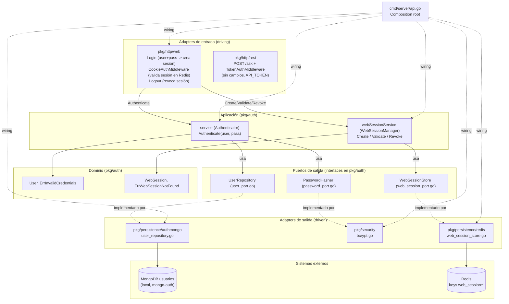

## Context

`mongo-agent` autentica hoy con un único secreto compartido `API_TOKEN`: la API
REST (`POST /ask`) por header `Authorization`, y la interfaz web (`/web`) por una
cookie cuyo valor es el propio `API_TOKEN`, emitida cuando el formulario de login
recibe ese token. No hay concepto de usuario.

Este cambio introduce un login web con usuario y contraseña, validado contra una
base MongoDB **local y dedicada** (separada del cluster Atlas de solo lectura del
agente), con contraseñas hasheadas (bcrypt) y un usuario de prueba precargado. En
paralelo, integra el binario Go y esa base de usuarios en `docker-compose.yml`
para que `docker-compose up` levante todo.

Este documento fija las decisiones técnicas para que `tasks.md` se ejecute de
forma mecánica.

## Goals / Non-Goals

**Goals:**
- Login web con `username` + `password` validado contra MongoDB, con verificación bcrypt.
- Base MongoDB de usuarios local, con conexión y variables de entorno propias, sin mezclarse con `MONGODB_URI` (Atlas de solo lectura).
- Usuario de prueba precargado por seed al levantar el compose; credenciales en claro solo en documentación.
- `docker-compose up` levanta Redis + base de usuarios (seedeada) + API Go, enlazados y con healthchecks.
- Nueva lógica de auth en arquitectura hexagonal (`pkg/auth` dominio/aplicación + puertos; adapters en `pkg/persistence/authmongo` y `pkg/security`).

**Non-Goals:**
- No hay registro (sign-up), CRUD de usuarios, recuperación de contraseña, roles ni permisos.
- No hay JWT, "recordarme" (remember-me), multi-dispositivo ni revocación masiva de sesiones: la sesión web es un identificador opaco por login, respaldado en Redis con TTL y borrado en logout (ver D2). Suficiente para una POC.
- No se cambia la autenticación de `POST /ask` (sigue por `API_TOKEN`; ver D1).
- No se toca el dominio del agente (`pkg/agent`) ni el adapter de solo lectura (`pkg/persistence/mongodb`).
- No se añade multiusuario real ni bloqueo por intentos fallidos ni protección de fuerza bruta (fuera del alcance POC).

## Decisiones técnicas

### D1. La API REST `POST /ask` mantiene `API_TOKEN`; el login de usuario aplica solo a la web

El login de usuario/contraseña se introduce **únicamente en la superficie web**
(humana). `POST /ask` es una API máquina-a-máquina (curl/scripts) donde el token
en header es idiomático; convertirla a usuario/contraseña exigiría emitir y
validar sesiones/JWT, algo fuera del alcance de una POC. Por tanto:

- `pkg/http/rest` y `TokenAuthMiddleware` **no cambian**.
- El login de usuario solo afecta a `POST /web/login` y `login.html`.

### D2. La cookie de sesión web transporta un session ID opaco respaldado en Redis

**Bug corregido.** El modelo anterior fijaba la cookie web con el valor
`API_TOKEN` (un secreto de servidor único y estático) y `CookieAuthMiddleware`
la comparaba contra ese mismo `API_TOKEN`. Consecuencia: la cookie valía lo mismo
para todos los usuarios y cualquiera que ya la tuviera —o que adivinara/conociera
`API_TOKEN` (un único secreto compartido)— entraba a `/web` sin pasar jamás por el
login real de usuario/contraseña. El login por usuario/contraseña quedaba
puenteado.

Decisión: **reemplazar el modelo cookie=`API_TOKEN` por sesiones reales de usuario
respaldadas en Redis del lado servidor.**

- Tras validar usuario/contraseña con `pkg/auth` (`Authenticator`, que **no se
  toca**), `Login` crea una **sesión web**: un session ID aleatorio y opaco
  (distinto de los session IDs de conversación del agente) y guarda en Redis un
  registro con TTL que asocia ese ID con al menos el `username` autenticado y su
  timestamp de creación.
- La cookie transporta ese session ID opaco. NUNCA `API_TOKEN`, NUNCA la contraseña.
- `CookieAuthMiddleware` deja de comparar contra un valor estático: en cada
  request lee el session ID de la cookie y lo valida contra Redis (la key existe y
  no ha expirado). Si es válida, deja pasar; si no, redirige a login con el mismo
  comportamiento htmx vs. request normal de hoy.
- `Logout` borra la key de Redis (invalidación del lado servidor), además de
  expirar la cookie del navegador. Así una sesión cerrada no se puede reutilizar
  aunque el cliente conserve el valor de la cookie.

Este modelo separa dos conceptos distintos que no deben confundirse: la **sesión
de chat del agente** (`agent.SessionStore`, memoria de conversación) y la **sesión
de autenticación web** (`auth.WebSessionStore`, este cambio). Son almacenes, IDs y
ciclos de vida distintos.

La API REST `POST /ask` con `TokenAuthMiddleware`/`API_TOKEN` **no cambia**: es su
propio mecanismo máquina-a-máquina, independiente del login web (ver D1). El
session ID de la web nunca se acepta en `POST /ask`, y `API_TOKEN` nunca se acepta
como cookie web. Se documenta explícitamente para que no se reintroduzca la
confusión que causó el bug.

### D3. Nuevo dominio/aplicación `pkg/auth` con puertos hexagonales

Se replica el estilo de `pkg/agent` (dominio puro + puertos definidos en el
paquete consumidor, implementados por adapters externos):

- **Dominio** (`pkg/auth/auth.go`): entidad `User` y error de dominio `ErrInvalidCredentials`. Sin dependencias de infraestructura (no importa `mongo`, ni `bcrypt`, ni `os`).
- **Puerto de entrada / caso de uso** (`pkg/auth/authenticator.go` + `pkg/auth/service.go`): interfaz `Authenticator` y su implementación `service`.
- **Puertos de salida** (definidos en `pkg/auth`, implementados por adapters):
  - `UserRepository` (`pkg/auth/user_port.go`): lectura del usuario por nombre.
  - `PasswordHasher` (`pkg/auth/password_port.go`): comparación de contraseña contra hash.

Contratos exactos:

```go
// pkg/auth/auth.go
package auth

import "errors"

// User es un usuario del sistema de login. PasswordHash es un hash bcrypt.
type User struct {
    Username     string
    PasswordHash string
}

// ErrInvalidCredentials se devuelve cuando usuario o contraseña no son válidos.
// No distingue entre "usuario inexistente" y "contraseña incorrecta".
var ErrInvalidCredentials = errors.New("invalid credentials")
```

```go
// pkg/auth/authenticator.go
package auth

import "context"

// Authenticator es el puerto de entrada (driving) del caso de uso de login.
type Authenticator interface {
    Authenticate(ctx context.Context, username, password string) (User, error)
}
```

```go
// pkg/auth/user_port.go
package auth

import (
    "context"
    "errors"
)

// UserRepository es el puerto de salida (driven) hacia la base de usuarios.
// INVARIANTE: solo lee usuarios; jamás escribe, actualiza ni borra.
type UserRepository interface {
    FindByUsername(ctx context.Context, username string) (User, error)
}

// ErrUserNotFound lo devuelve el repositorio cuando no existe el usuario.
var ErrUserNotFound = errors.New("user not found")
```

```go
// pkg/auth/password_port.go
package auth

// PasswordHasher es el puerto de salida (driven) para verificar contraseñas.
type PasswordHasher interface {
    // Compare devuelve nil si plaintext corresponde a hashedPassword,
    // y un error en caso contrario.
    Compare(hashedPassword, plaintext string) error
}
```

Caso de uso:

```go
// pkg/auth/service.go
package auth

import "context"

type service struct {
    users  UserRepository
    hasher PasswordHasher
}

func NewService(users UserRepository, hasher PasswordHasher) Authenticator {
    return &service{users: users, hasher: hasher}
}

func (s *service) Authenticate(ctx context.Context, username, password string) (User, error) {
    u, err := s.users.FindByUsername(ctx, username)
    if err != nil {
        return User{}, ErrInvalidCredentials
    }
    if err := s.hasher.Compare(u.PasswordHash, password); err != nil {
        return User{}, ErrInvalidCredentials
    }
    return u, nil
}
```

Regla de no-fuga: `Authenticate` devuelve siempre `ErrInvalidCredentials` tanto
para usuario inexistente como para contraseña incorrecta, para no revelar cuál de
los dos falló.

### D4. Adapter de repositorio en paquete separado `pkg/persistence/authmongo`

El adapter de usuarios NO va en `pkg/persistence/mongodb` porque ese paquete
tiene el invariante de solo lectura verificado con `VerifyReadOnlyGuarantee`;
mezclarlo confundiría esa garantía. Se crea un paquete nuevo:

```go
// pkg/persistence/authmongo/user_repository.go
package authmongo

import (
    "context"
    "errors"
    "time"

    "go.mongodb.org/mongo-driver/bson"
    "go.mongodb.org/mongo-driver/mongo"

    "github.com/HongXiangZuniga/mongo-agent/pkg/auth"
)

type userDoc struct {
    Username     string `bson:"username"`
    PasswordHash string `bson:"password_hash"`
}

type repository struct {
    coll         *mongo.Collection
    queryTimeout time.Duration
}

func NewUserRepository(db *mongo.Database, collectionName string, queryTimeout time.Duration) auth.UserRepository {
    return &repository{coll: db.Collection(collectionName), queryTimeout: queryTimeout}
}

func (r *repository) FindByUsername(ctx context.Context, username string) (auth.User, error) {
    ctx, cancel := context.WithTimeout(ctx, r.queryTimeout)
    defer cancel()

    var doc userDoc
    err := r.coll.FindOne(ctx, bson.M{"username": username}).Decode(&doc)
    if errors.Is(err, mongo.ErrNoDocuments) {
        return auth.User{}, auth.ErrUserNotFound
    }
    if err != nil {
        return auth.User{}, err
    }
    return auth.User{Username: doc.Username, PasswordHash: doc.PasswordHash}, nil
}
```

Documento MongoDB del usuario (colección `users` por defecto):

```json
{ "username": "admin", "password_hash": "$2a$10$..." }
```

### D5. Adapter bcrypt en `pkg/security`

```go
// pkg/security/bcrypt.go
package security

import (
    "golang.org/x/crypto/bcrypt"

    "github.com/HongXiangZuniga/mongo-agent/pkg/auth"
)

type bcryptHasher struct{}

func NewBcryptHasher() auth.PasswordHasher { return bcryptHasher{} }

func (bcryptHasher) Compare(hashedPassword, plaintext string) error {
    return bcrypt.CompareHashAndPassword([]byte(hashedPassword), []byte(plaintext))
}
```

`golang.org/x/crypto/bcrypt` ya está disponible (`golang.org/x/crypto v0.48.0`
en `go.mod`). `go mod tidy` la promoverá de indirecta a directa.

### D6. Cambios en el adapter web (`pkg/http/web`)

Nota: la parte de login por usuario/contraseña ya está implementada; esta sección
la actualiza para el modelo de sesión real en Redis (ver D2 y tareas de la sección
14 en `tasks.md`).

- `webPort` añade, además de `authenticator auth.Authenticator`, el campo `webSessions auth.WebSessionManager`.
- `NewWebHandler` amplía su firma a `func NewWebHandler(agentService agent.AgentService, cookieCfg CookieConfig, scrubber *utils.SecretScrubber, authenticator auth.Authenticator, webSessions auth.WebSessionManager) WebHandlers`.
- `Login` (`handlers.go`): lee `username`/`password` con `c.PostForm` e invoca `p.authenticator.Authenticate(ctx, username, password)`. Si falla, re-renderiza `login` con `Error: "Usuario o contraseña inválidos"` y `401`. Si es válido, invoca `sessionID, err := p.webSessions.Create(ctx, username)`; si eso falla, re-renderiza `login` con `Error: "No se pudo iniciar la sesión, inténtalo de nuevo"` y `503`; si tiene éxito, fija la cookie con **valor `sessionID`** (mismo `SameSite=Strict`, nombre `p.cookieCfg.CookieName`, `MaxAge`, path `/web`, `Secure`, `HttpOnly=true`) y redirige `303` a `/web`.
- `Logout` (`handlers.go`): lee el session ID de la cookie (`c.Cookie(p.cookieCfg.CookieName)`); si existe y no está vacío, invoca `p.webSessions.Revoke(ctx, sessionID)` (best-effort: ignora el error); luego expira la cookie del navegador (`MaxAge=-1`) igual que hoy y redirige `303` a `/web/login`.
- `CookieAuthMiddleware` (`middleware.go`) **cambia**: su firma pasa a `func CookieAuthMiddleware(cfg CookieConfig, sessions auth.WebSessionManager) gin.HandlerFunc`. Lee el session ID de la cookie; si está vacío o `sessions.Validate(ctx, sessionID)` devuelve error, llama `denyAuth(c)` (comportamiento htmx vs. normal sin cambios). Se elimina el import `"crypto/subtle"` y toda comparación contra `cfg.APIToken`.
- `CookieConfig` (`config.go`): se **elimina** el campo `APIToken` (ya no se usa). Quedan `CookieName`, `MaxAge`, `Secure`.
- `RegisterRoutes` (`router.go`): su firma pasa a `func RegisterRoutes(r *gin.Engine, h WebHandlers, cfg CookieConfig, sessions auth.WebSessionManager)` y aplica `CookieAuthMiddleware(cfg, sessions)` al grupo `/web`.
- `LoginForm` y `login.html`: sin cambios respecto a lo ya implementado (dos campos usuario/contraseña).

### D7. Wiring en el composition root (`cmd/server/api.go`)

En `init()`: leer y validar las nuevas variables:

```go
authMongodbURI            = getenv("AUTH_MONGODB_URI", "")
authMongodbDBName         = getenv("AUTH_MONGODB_DB_NAME", "")
authMongodbUsersColl      = getenv("AUTH_MONGODB_USERS_COLLECTION", "users")
// ...
requireEnv("AUTH_MONGODB_URI", authMongodbURI)
requireEnv("AUTH_MONGODB_DB_NAME", authMongodbDBName)
```

En `main()`: reutilizar `initMongo` para abrir una **segunda** conexión a la base
de usuarios (sin `VerifyReadOnlyGuarantee`, que sigue aplicándose solo a la
conexión del agente), construir el servicio de auth y —para la corrección de
sesión— reutilizar el `redisClient` ya inicializado por `initRedis` para el
almacén de sesiones web y su caso de uso:

```go
authDB := initMongo(authMongodbURI, authMongodbDBName)
userRepo := authmongo.NewUserRepository(authDB, authMongodbUsersColl, mongodbQueryTimeout)
passwordHasher := security.NewBcryptHasher()
authService := auth.NewService(userRepo, passwordHasher)

// Corrección: sesión web real respaldada en Redis (ver D2, D10-D12).
webSessionStore := redisadapter.NewWebSessionStore(redisClient, webSessionMaxAge)
webSessionManager := auth.NewWebSessionManager(webSessionStore)

cookieCfg := web.CookieConfig{
    CookieName: webAuthCookieName,
    MaxAge:     webSessionMaxAge,
    Secure:     webCookieSecure,
}
webHandler := web.NewWebHandler(agentService, cookieCfg, secretScrubber, authService, webSessionManager)
web.RegisterRoutes(r, webHandler, cookieCfg, webSessionManager)
```

- El campo `APIToken` desaparece de `CookieConfig`; `apiToken` se sigue usando solo para `rest.RegisterRoutes(r, agentHandler, apiToken)` y para el `secretScrubber`.
- `webSessionMaxAge` (de `WEB_SESSION_MAX_AGE_SECONDS`) se reutiliza como TTL de la sesión web en Redis (ver D12): así la cookie y la sesión de servidor caducan a la vez.
- El orden importa: `VerifyReadOnlyGuarantee` se llama solo sobre `mdb` (conexión del agente construida con `mongodbURI`), nunca sobre `authDB`.

### D8. docker-compose: servicios `api` y `mongo-auth`

`mongo-auth` (imagen oficial `mongo`), con `MONGO_INITDB_DATABASE=authdb` para
que el seed corra en esa base, volumen para persistencia, healthcheck con
`mongosh` y el seed montado en `/docker-entrypoint-initdb.d`:

```yaml
mongo-auth:
  image: mongo:7
  container_name: mongo-agent-auth-db
  environment:
    - MONGO_INITDB_DATABASE=authdb
  volumes:
    - mongo_auth_data:/data/db
    - ./build/mongo-auth/seed.js:/docker-entrypoint-initdb.d/seed.js:ro
  ports:
    - "27017:27017"
  healthcheck:
    test: ["CMD", "mongosh", "--quiet", "--eval", "db.adminCommand('ping').ok"]
    interval: 5s
    timeout: 5s
    retries: 10
  networks:
    - agente_net
```

`api` (build del Dockerfile existente), depende de `redis` y `mongo-auth`
saludables, con overrides de host de red de compose:

```yaml
api:
  build:
    context: .
    dockerfile: build/docker/Dockerfile
  container_name: mongo-agent-api
  env_file:
    - .env
  environment:
    - REDIS_ADDR=redis:6379
    - AUTH_MONGODB_URI=mongodb://mongo-auth:27017
    - AUTH_MONGODB_DB_NAME=authdb
    - AUTH_MONGODB_USERS_COLLECTION=users
  ports:
    - "8080:8080"
  depends_on:
    redis:
      condition: service_healthy
    mongo-auth:
      condition: service_healthy
  networks:
    - agente_net
```

`redis` gana un healthcheck (`redis-cli ping`). Se añade el volumen
`mongo_auth_data`. El `.env` sigue aportando los secretos externos (`API_TOKEN`,
`MONGODB_URI` de Atlas, `MONGODB_DB_NAME`, `OPENCODE_API_KEY`). Los valores de
`environment:` (hosts de red de compose) sobreescriben los del `.env` (pensados
para `go run` local con `localhost`).

Nota sobre el seed y el volumen: los scripts de `/docker-entrypoint-initdb.d` solo
corren cuando el directorio de datos está vacío (primera inicialización del
volumen). Para reejecutar el seed desde cero: `docker-compose down -v`. El seed
usa `updateOne(..., { upsert: true })` para ser idempotente.

### D9. Seed y usuario de prueba

`build/mongo-auth/seed.js` inserta (upsert) el usuario de prueba con un hash
bcrypt precomputado. Credenciales de prueba documentadas:

- **Usuario:** `admin`
- **Contraseña:** `admin123`

El hash bcrypt de `admin123` es no determinista (sal aleatoria); cualquier hash
bcrypt válido de `admin123` sirve. La tarea correspondiente en `tasks.md` genera
el hash con Go y lo pega en `seed.js`. El `.js` guarda solo el hash, nunca la
contraseña en claro.

### D10. Puerto de salida `WebSessionStore` (dominio de sesión web en `pkg/auth`)

La sesión de autenticación web es un concepto de auth, así que su puerto vive en
`pkg/auth`, análogo a cómo `agent.SessionStore` vive en `pkg/agent`. Es un puerto
de salida (driven) implementado por un adapter Redis.

```go
// pkg/auth/web_session_port.go
package auth

import (
    "context"
    "errors"
    "time"
)

// WebSession es el registro de una sesión de autenticación web.
type WebSession struct {
    Username  string
    CreatedAt time.Time
}

// WebSessionStore es el puerto de salida (driven) para persistir sesiones web.
// La política de expiración (TTL) la aplica el adapter que lo implementa.
type WebSessionStore interface {
    Save(ctx context.Context, sessionID string, session WebSession) error
    Find(ctx context.Context, sessionID string) (WebSession, error)
    Delete(ctx context.Context, sessionID string) error
}

// ErrWebSessionNotFound lo devuelve el store cuando la sesión no existe o expiró.
var ErrWebSessionNotFound = errors.New("web session not found")
```

Nota de estilo: el TTL se configura en el constructor del adapter (igual que
`redis.NewSessionStore(client, ttl)` para conversaciones), no se pasa en cada
`Save`. Así el store aplica la expiración de forma uniforme.

### D11. Caso de uso `WebSessionManager` (puerto de entrada en `pkg/auth`)

El adapter web (handlers + middleware) consume un puerto de entrada (driving) que
orquesta la creación/validación/revocación de sesiones. Genera el session ID
opaco con `crypto/rand` (256 bits, hex → 64 caracteres), distinto de los UUID de
conversación del agente.

```go
// pkg/auth/web_session.go
package auth

import (
    "context"
    "crypto/rand"
    "encoding/hex"
    "time"
)

// WebSessionManager es el puerto de entrada (driving) para las sesiones web.
type WebSessionManager interface {
    Create(ctx context.Context, username string) (sessionID string, err error)
    Validate(ctx context.Context, sessionID string) (WebSession, error)
    Revoke(ctx context.Context, sessionID string) error
}

type webSessionService struct {
    store WebSessionStore
    now   func() time.Time
}

func NewWebSessionManager(store WebSessionStore) WebSessionManager {
    return &webSessionService{store: store, now: func() time.Time { return time.Now().UTC() }}
}

func (s *webSessionService) Create(ctx context.Context, username string) (string, error) {
    buf := make([]byte, 32)
    if _, err := rand.Read(buf); err != nil {
        return "", err
    }
    sessionID := hex.EncodeToString(buf)
    if err := s.store.Save(ctx, sessionID, WebSession{Username: username, CreatedAt: s.now()}); err != nil {
        return "", err
    }
    return sessionID, nil
}

func (s *webSessionService) Validate(ctx context.Context, sessionID string) (WebSession, error) {
    if sessionID == "" {
        return WebSession{}, ErrWebSessionNotFound
    }
    return s.store.Find(ctx, sessionID)
}

func (s *webSessionService) Revoke(ctx context.Context, sessionID string) error {
    if sessionID == "" {
        return nil
    }
    return s.store.Delete(ctx, sessionID)
}
```

`pkg/auth` sigue sin importar infraestructura: `crypto/rand`, `encoding/hex`,
`context` y `time` son stdlib (mismo criterio por el que `pkg/agent` genera sus
IDs con la librería `uuid` dentro del servicio).

### D12. Adapter Redis `WebSessionStore` y decisión de TTL

Nuevo archivo `pkg/persistence/redis/web_session_store.go` (mismo paquete `redis`
ya usado para conversaciones), reutilizando el `*goredis.Client` inyectado. No se
mezcla con las keys de conversación: usa un namespace propio con el prefijo
`web_session:`.

- **Naming de keys:** `web_session:<sessionID>` (una key por sesión). Las keys de conversación (`session:<id>:messages`, `session:<id>:meta`, `sessions:index`) quedan intactas y en otro namespace.
- **Serialización:** el valor es JSON `{ "username": ..., "created_at": <unix> }`, siguiendo el estilo `encoding/json` del store de conversaciones.
- **TTL:** se aplica con `SET key value EX <ttl>` (`client.Set(ctx, key, data, ttl)`). `Find` mapea `goredis.Nil` (key ausente o expirada) a `auth.ErrWebSessionNotFound`. `Delete` hace `DEL`.
- **Constructor:** `func NewWebSessionStore(client *goredis.Client, ttl time.Duration) auth.WebSessionStore`.

**Decisión de TTL (variable de entorno):** se **reutiliza
`WEB_SESSION_MAX_AGE_SECONDS`** (ya existente, default `604800` = 7 días, hoy
usado para el `MaxAge` de la cookie) como TTL de la sesión en Redis.
Justificación:

- NO se reutiliza `SESSION_TTL_SECONDS`: ese TTL gobierna la memoria de conversación del agente (otro concepto y otro ciclo de vida).
- NO se añade una env var nueva (`WEB_AUTH_SESSION_TTL_SECONDS`): el `MaxAge` de la cookie y el TTL de la sesión de servidor expresan el mismo concepto —cuánto dura el login web— y deben mantenerse sincronizados para que cookie y sesión de servidor caduquen a la vez. Un único valor evita el footgun de dos knobs que hay que mantener iguales. Si en el futuro se necesitaran ciclos de vida independientes (p. ej. cookie corta con renovación de sesión larga), se introduciría `WEB_AUTH_SESSION_TTL_SECONDS` sin tocar el resto del diseño.

## Architecture Overview (Hexagonal)



Regla de dependencia: `pkg/auth` (dominio + aplicación) no importa
infraestructura; los adapters (`authmongo`, `security`, y el nuevo
`web_session_store.go` en `pkg/persistence/redis`) dependen de `pkg/auth`, nunca
al revés. `pkg/agent` y `pkg/persistence/mongodb` quedan intactos.

## Decisión sobre modelado de capability

El login web ya lo describía `chat-web-frontend` (en `add-htmx-chat-frontend`),
pero ese spec aún no está materializado en `openspec/specs/`. Igual que
`harden-agent-security`, este cambio se modela como **capability nueva**
(`user-authentication`) con requisitos ADDED, en vez de MODIFIED sobre una base
inexistente, para que `openspec validate --strict` no falle por no encontrar el
requisito original. El requisito "La API REST Conserva la Autenticación por
Token" se incluye para dejar explícito que `POST /ask` no cambia.

## Estrategia de testing por capa

- **Dominio/Aplicación (`pkg/auth`)** — sin mocks de infraestructura, con fakes de los puertos:
  - `TestAuthenticate_ValidCredentialsReturnsUser`: `fakeUserRepo` devuelve un usuario, `fakeHasher.Compare` devuelve `nil` → `Authenticate` devuelve el usuario sin error.
  - `TestAuthenticate_WrongPasswordReturnsInvalidCredentials`: `fakeHasher.Compare` devuelve error → `Authenticate` devuelve `ErrInvalidCredentials`.
  - `TestAuthenticate_UnknownUserReturnsInvalidCredentials`: `fakeUserRepo.FindByUsername` devuelve `ErrUserNotFound` → `Authenticate` devuelve `ErrInvalidCredentials` (mismo error, sin distinguir).
- **Adapter bcrypt (`pkg/security`)** — test real (sin mock): `TestBcryptHasher_CompareMatches` genera un hash de una contraseña y verifica que `Compare` la acepta y rechaza una distinta.
- **Caso de uso de sesión web (`pkg/auth`)** — con un `fakeWebSessionStore` (sin Redis real):
  - `TestWebSession_CreateStoresAndReturnsOpaqueID`: `Create(ctx, "admin")` devuelve un ID no vacío, distinto en cada llamada, y el fake recibió un `Save` con `WebSession{Username:"admin"}`.
  - `TestWebSession_ValidateUnknownReturnsErr`: el fake `Find` devuelve `ErrWebSessionNotFound` → `Validate` propaga `ErrWebSessionNotFound` (verificado con `errors.Is`); además `Validate(ctx, "")` devuelve `ErrWebSessionNotFound` sin tocar el store.
  - `TestWebSession_RevokeDeletes`: `Revoke(ctx, id)` invoca `Delete` del fake con ese `id`.
- **Adapter web (`pkg/http/web`)** — `httptest` con `fakeAuthenticator` y `fakeWebSessionManager`:
  - `TestLogin_ValidCredentialsCreatesSessionAndSetsCookie`: `POST /web/login` con credenciales que el fake acepta → `303` a `/web`, cookie fijada con **valor igual al session ID devuelto por el fake** (no `API_TOKEN`).
  - `TestLogin_InvalidCredentialsReturns401`: el `fakeAuthenticator` devuelve `ErrInvalidCredentials` → `401`, sin cookie, formulario re-renderizado con error, y `Create` NO se invoca.
  - `TestCookieAuth_ValidSessionAllows`: cookie con un ID que el `fakeWebSessionManager.Validate` acepta → la ruta protegida responde `200`.
  - `TestCookieAuth_InvalidSessionRedirects`: `Validate` devuelve error → `303` a `/web/login` (y `HX-Redirect` si `HX-Request: true`).
  - `TestCookieAuth_ArbitraryCookieRejected` (**regresión del bug**): una cookie cuyo valor es `API_TOKEN` (o cualquier string no registrado) hace que `Validate` falle → se rechaza el acceso. Confirma que ya no basta con conocer `API_TOKEN`.
  - `TestLogout_RevokesServerSession`: `POST /web/logout` con una cookie de sesión → invoca `Revoke` del fake con ese ID y expira la cookie (`Max-Age=0`/`-1`).
- **Adapter Mongo (`pkg/persistence/authmongo`)** — test de integración (build tag `integration`, requiere Mongo real): `TestFindByUsername_ReturnsSeededUser` y `TestFindByUsername_UnknownReturnsErrUserNotFound`. No se ejecuta en `make unit-test`.
- **Adapter Redis de sesión web (`pkg/persistence/redis`)** — test de integración (build tag `integration`, requiere Redis real): `TestWebSessionStore_SaveFindDeleteRoundTrip` (guarda, encuentra el mismo `username`, borra y luego `Find` devuelve `auth.ErrWebSessionNotFound`). No se ejecuta en `make unit-test`.

## UI/UX

El cambio de UI es mínimo: `login.html` pasa de un input (`token`) a dos inputs
(`username`, `password`), reutilizando el sistema visual ya definido para la
pantalla de login en `openspec/changes/add-htmx-chat-frontend/design-ui.md`
(clases `login-box`, `.error`, `btn-primary`, paleta y tipografía existentes). No
introduce paleta, layout ni componentes nuevos, por lo que no se delega al
subagente `ui-ux-designer`: se reutilizan las decisiones visuales ya vigentes.
Ver `add-htmx-chat-frontend/design-ui.md` para el sistema de diseño aplicable.
